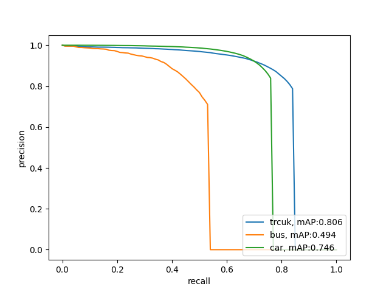

## 객체 검출 모델

본 과제에서 구축한 차량 검출 데이터셋 검증을 위해 객체 검출 모델을 사용

### Reference code

#### Detectron2

* Detectron2는 최첨단 객체 감지 알고리즘을 구현하는 Facebook AI Research의 차세대 소프트웨어 시스템 

* 이전 버전인 [Detectron](https://github.com/facebookresearch/Detectron/)을 완전히 재작성한 것으로 [maskrcnn-benchmark](https://github.com/facebookresearch/maskrcnn-benchmark/)를 기반으로 모델을 구성함

#### Detectron2 official code

Facebook AI Research에서 만든 Detectron2 공식 GitHub 주소

https://github.com/facebookresearch/detectron2

## 사용방법

데이터셋, 모델웨이트, 도커 등 세팅 방법은 [이 링크](https://github.com/chamchi99/Highway-CCTV-KETI/blob/main/Object_detection/docker/README.md) 참조

## Result (PR-Curve)

