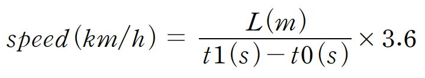
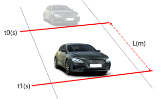
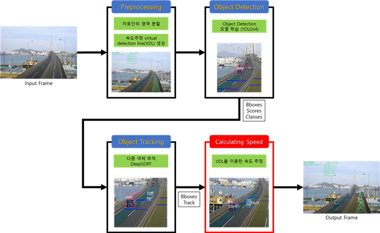

# virtual detection lines(VDLs)을 이용한 속도 추정 알고리즘

본 알고리즘은 NIA 교통안전 AI 데이터 구축 사업의 결과물로서, 한국전자기술연구원(Korea Electronics Techonology Institute, KETI)에서 개발한 알고리즘이다.

This algorithm is the result of the NIA traffic safety AI data construction project and is an algorithm developed by Korea Electronics Techonology Institute (KETI).
If you want to see the English version of README.md file, click this [link][english].

[english]: https://github.com/swhan0329/VDL_speed_estimation/blob/master/README(ENG).md

## 알고리즘 설명

### VDL이란

VDL이란 차량의 속도 추정을 위해 사용하는 가상의 선으로서, 차량이 두 개의 선을 지난 시간을 이용하여 차량의 속도를 계산한다. 아래 그림과 같은 상황에서 차량 속도 추정을 다음과 같은 식으로 얻을 수 있다.





### 속도추정 알고리즘

본 프로젝트를 진행하면서 차량 속도 추정 방법에 대해서 여러가지 시도를 했다. [속도 추정 알고리즘 성능분석 보고서](https://github.com/chamchi99/Highway-CCTV-KETI/blob/main/Speed_estimation/%EC%86%8D%EB%8F%84%20%EC%B6%94%EC%A0%95%20%EC%95%8C%EA%B3%A0%EB%A6%AC%EC%A6%98-v1.0.pdf)에서 확인할 수 있다.

### 전체 알고리즘 흐름도

본 레포지토리에서 제공하는 코드는 .py 파일 자체 만으로 실행할 수 없다. 속도를 추정하기 위해서, 객체 검출 및 트래킹이 선행적으로 이뤄져야 한다. 아래 그림과 같이 입력 영상이 들어오면 한 프레임씩 입력받아 전처리(Preprocessing), 객체 검출(Object detection), 객체 트래킹(Object tracking) 
과정을 거친 후, 최종적으로 객체 트래킹의 결과물인 Bboxes와 track 클래스를 이용하여 객체별 속도를 추정한다. 자세한 내용은 [VDL활용 속도추정 알고리즘 매뉴얼](https://github.com/chamchi99/Highway-CCTV-KETI/blob/main/Speed_estimation/VDL%ED%99%9C%EC%9A%A9%20%EC%86%8D%EB%8F%84%EC%B6%94%EC%A0%95%20%EC%95%8C%EA%B3%A0%EB%A6%AC%EC%A6%98%20%EB%A7%A4%EB%89%B4%EC%96%BC-v1.1.pdf)에서 확인할 수 있다.



## 알고리즘 사용 방법

### Reference code
객체 검출 및 트래킹의 baseline 코드는 이 [GitHub][link]를 참고하였다. Environment 또한, 이 링크와 동일하게 진행하였다.

[link]: https://github.com/yehengchen/Object-Detection-and-Tracking/tree/master/OneStage/yolo/deep_sort_yolov4

### calc_speed.py 사용 방법

1. baseline으로 사용한 YOLOv4 + DeepSORT GitHub를 clone 한다.

```bash
git clone https://github.com/yehengchen/Object-Detection-and-Tracking/tree/master/OneStage/yolo/deep_sort_yolov4
```

2. deep_sort 폴더 내에 있는 track.py 파일을 본 레포지토리에 있는 track.py로 변경한다.

3. main.py 파일 상단에 아래와 같이 입력하여, calcSpeed 함수를 import 한다.

```python
from calc_speed import calcSpeed
```

4. 객체 검출 결과를 이용하여 객체 트래킹 모듈로부터 출력값을 얻은 뒤, 해당 출력값을 이용하여 아래 구문과 같이 속도 추정 함수를 사용한다.

```python
track = calcSpeed(track, luLine, ldLine, ruLine, rdLine, bbox, frame_idx)
```

## 알고리즘 사용 결과

[](https://youtu.be/URZX3wHVAZc?t=0s)
